# Production-Grade CI/CD Infrastructure
This repository documents a production-like CI/CD infrastructure for deploying applications to Kubernetes. The goal is to control the full delivery flow from pull request validation, quality checks, image build, GitOps manifest updates, and automated or manually approved deployments.

## Operating Goals

- No direct push to environment branches.
- Every change must go through a Pull Request.
- Pull Requests must pass CI and quality gates before they can be merged.
- Merging into `dev` automatically runs CI/CD and deploys to the dev environment.
- Merging into `main` is used for production and requires approval before both merge and production deployment.
- Deployment manifests are managed through GitOps so changes are auditable and rollback-friendly.

## Infrastructure Components

| Component | Responsibility |
|---|---|
| GitHub | Stores source code, manages Pull Requests, branch protection, and required status checks |
| Jenkins Multibranch Pipeline | Detects PRs and branches automatically, then orchestrates CI/CD |
| Jenkins Shared Library | Provides reusable pipeline logic for build, test, scan, Docker, GitOps, and deployment verification |
| SonarCloud | Runs code quality analysis and enforces quality gates |
| Trivy | Scans dependencies and container images for vulnerabilities |
| GHCR | Stores built Docker images |
| GitOps manifest repository | Stores Kubernetes manifests for each environment |
| ArgoCD | Syncs manifests from the GitOps repository to Kubernetes |
| k3s / Kubernetes | Runs workloads for dev and production environments |
| Terraform / IaC | Provisions base infrastructure such as Jenkins, k3s nodes, and supporting resources |

## Branch and Environment Model

| Branch | Environment | Deployment Behavior | Protection Policy |
|---|---|---|---|
| `dev` | Dev | Automatically deploys after a PR is merged | Protected, no direct push, PR required, CI must pass |
| `main` | Production | Deploys only after merge and manual approval | Protected, no direct push, PR required, CI must pass, reviewer approval and manual deployment gate required |

Standard flow:

```text
feature/* -> Pull Request -> dev  -> Auto deploy to Dev
dev       -> Pull Request -> main -> Manual approval -> Deploy to Production
```

## Branch Protection

Both `dev` and `main` should be protected:

- Direct pushes from developers or maintainers are blocked.
- Pull Requests are required before code can enter an environment branch.
- Jenkins CI status checks must pass before merge.
- Reviewer approval is required before merge.
- For `main`, Code Owner review or production environment approval should also be enabled.
- Merges should be blocked when the PR branch is out of date with the target branch.

This prevents unvalidated code from going directly to either dev or production.

## Pull Request Flow

When a developer opens a Pull Request into `dev` or `main`, Jenkins Multibranch Pipeline automatically runs CI:

```text
Pull Request
  -> Checkout source code
  -> Load Jenkins Shared Library
  -> Build application
  -> Run unit tests / integration tests
  -> Run SonarCloud analysis
  -> Enforce quality gate
  -> Run security scan
  -> Report status check back to GitHub
```

Rules:

- Pull Requests are validation-only and do not deploy to the target environment.
- If build, tests, quality gate, or security scan fails, the PR cannot be merged.
- Reviewers merge only after CI passes and the code change is approved.

## Dev Deployment

After a PR is merged into `dev`, Jenkins automatically runs the branch pipeline for `dev`:

```text
Merge into dev
  -> Jenkins CI/CD
  -> Build Docker image
  -> Scan image with Trivy
  -> Push image to GHCR
  -> Update dev manifest in the GitOps repository
  -> ArgoCD syncs to the dev Kubernetes environment
  -> Verify application health and rollout status
```

The dev environment is deployed automatically so the team can validate changes quickly after each approved merge. The source of truth for deployment state is the GitOps manifest repository, not manual changes made directly in the cluster.

## Production Deployment

Production follows a stricter workflow than dev:

```text
Pull Request from dev to main
  -> Jenkins CI
  -> Quality gate / security gate
  -> Reviewer approval
  -> Merge into main
  -> Jenkins prepares the release
  -> Manual approval for production deployment
  -> Update prod manifest in the GitOps repository
  -> ArgoCD syncs to the production Kubernetes environment
  -> Verify production rollout
```

Production-specific rules:

- Production is not deployed automatically from a Pull Request.
- Merge into `main` happens only after CI passes and reviewers approve the change.
- Production deployment requires a manual approval step so the responsible owner can confirm the release timing.
- Production should use an immutable image tag or digest that has already been built, scanned, and recorded in the pipeline logs.
- Production rollback should be performed by reverting the GitOps manifest to a previously stable image tag or digest.

## Jenkins Shared Library Role

Jenkinsfiles in application repositories should stay small. Shared CI/CD behavior is implemented in the Jenkins Shared Library so all projects follow the same delivery standard.

Example reusable steps:

```groovy
buildApp()
testApp()
sonarScan()
dockerBuild()
trivyScan()
dockerPush()
updateGitopsManifest()
verifyArgoApp()
```

Benefits:

- Standardizes pipelines across multiple applications.
- Reduces Jenkinsfile duplication.
- Makes shared policy changes easier, such as quality gates, scan rules, or GitOps update behavior.
- Improves auditability because deployment logic is maintained in one central place.

## Architecture Flow

```mermaid
flowchart LR
    Dev[Developer] --> PR[Pull Request]
    PR --> CI[Jenkins CI]
    CI --> Test[Build / Test / Quality Gate / Security Scan]
    Test -->|Pass| MergeDev[Merge into dev]
    Test -->|Fail| Block[Block merge]

    MergeDev --> DevCD[Jenkins CD dev]
    DevCD --> GHCR[Push image to GHCR]
    GHCR --> GitOpsDev[Update dev manifest]
    GitOpsDev --> ArgoDev[ArgoCD sync dev]
    ArgoDev --> K8sDev[Kubernetes dev]

    DevCD --> ReleasePR[PR from dev to main]
    ReleasePR --> ProdCI[Jenkins CI production]
    ProdCI --> Review[Reviewer approval]
    Review --> MergeMain[Merge into main]
    MergeMain --> Manual[Manual approval]
    Manual --> GitOpsProd[Update prod manifest]
    GitOpsProd --> ArgoProd[ArgoCD sync prod]
    ArgoProd --> K8sProd[Kubernetes production]
```



## Production-Grade Principles

- CI/CD logs must clearly trace a deployment from commit, PR, and image tag to the deployed manifest.
- Secrets must not be hard-coded in source code or Kubernetes manifests.
- Credentials for Jenkins, GHCR, GitOps, and ArgoCD must be stored in an appropriate credential store.
- Dev and production should be isolated by namespace, cluster, or cloud account depending on the infrastructure scale.
- Production deployment must include a manual approval gate and a clear approver.
- Rollback must be based on GitOps history instead of manual edits inside the cluster.
- If the pipeline fails at any quality or security gate, deployment must stop immediately.

## Standard End-to-End Flow

```text
1. Developer creates a feature branch.
2. Developer opens a PR into dev.
3. Jenkins runs CI for the PR.
4. If CI passes and the PR is approved, the change is merged into dev.
5. Merge into dev automatically builds, scans, pushes the image, and deploys to dev through GitOps and ArgoCD.
6. When the change is ready for release, a PR is opened from dev into main.
7. Jenkins runs CI again for the production PR.
8. If CI passes and reviewers approve, the change is merged into main.
9. The production pipeline waits for manual approval.
10. After approval, Jenkins updates the prod manifest and ArgoCD deploys to production.
```
