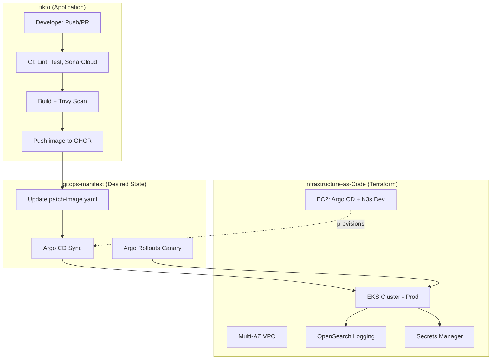

# 👋 Hi, This repository flavoriy focused on **CI/CD, Kubernetes, GitOps, and Infrastructure as Code on AWS**.
---

## 🚀 TikTo — Task & Calendar Planning App

TikTo is a task/calendar management app built as a monorepo, with one web frontend (BFF) and five internal microservices. It's the project where I put a full CI/CD + GitOps + IaC pipeline into real practice, not just a demo.

The system is split across **3 repos**, each owning a distinct layer of responsibility:

| Repo | Role | What's inside |
|---|---|---|
| [**tikto**](https://github.com/flavoriy/tikto) | Application code | Next.js frontend + 5 microservices, CI pipeline (test/scan/build/push image) |
| [**gitops-manifest**](https://github.com/flavoriy/gitops-manifest) | Desired state (GitOps) | Kubernetes manifests (Kustomize), Argo CD Applications, Argo Rollouts canary |
| [**Infrastructure-as-Code**](https://github.com/flavoriy/Infrastructure-as-Code) | Cloud infrastructure | Terraform modules provisioning VPC, EKS, EC2 (Argo CD / K3s dev), OpenSearch, Secrets Manager on AWS |

---

## 🗺️ System Overview

---

## 🔄 End-to-end CI/CD flow

1. **Code (`tikto` repo)**
   A developer opens a PR → the pipeline runs lint, typecheck, unit tests (Vitest), and a SonarCloud Quality Gate scan.

2. **Build & Security**
   On merge / release tag → build a Docker image (using a base Dockerfile pattern to save build time) → scan it with **Trivy** (blocks on HIGH/CRITICAL findings) → publish to **GHCR**.

3. **GitOps promotion (`gitops-manifest` repo)**
   The `tikto` CI pipeline automatically commits the new image tag to `patch-image.yaml` in the `gitops-manifest` repo. This is the handoff point between "code" and "the cluster's desired state."

4. **Deploy (Argo CD on EKS)**
   Argo CD detects the change in `gitops-manifest` and automatically syncs the workload to EKS. In **prod**, rollout uses **Argo Rollouts** (canary), gradually shifting traffic 10% → 50% → 80% → 100%, with automated smoke tests and log-based error monitoring via OpenSearch to auto-rollback if the error threshold is exceeded.

5. **Underlying infrastructure (`Infrastructure-as-Code` repo)**
   All the AWS infrastructure below (VPC, EKS, EC2 running Argo CD / K3s dev, OpenSearch, Secrets Manager) is provisioned with Terraform, fully decoupled from the application's CI/CD.

---

## 🌱 Dev vs Prod

| | **Dev** | **Prod** |
|---|---|---|
| Compute | Single K3s on EC2 (via Tailscale VPN, not public) | EKS Cluster (Spot Node Group) |
| Deploy strategy | Standard Deployment | Argo Rollouts Canary + automated Analysis |
| Traffic entry | Internal via VPN | AWS ALB → Istio Ingress Gateway |
| Purpose | Fast iteration, manifest sanity checks | Production traffic, with smoke tests + log-based rollback |

---

## 🛠️ Core tech stack

`Terraform` `AWS (VPC, EKS, EC2, ALB, OpenSearch, Secrets Manager)` `Kubernetes` `K3s` `Argo CD` `Argo Rollouts` `Istio` `GitHub Actions` `Docker` `Trivy` `SonarCloud` `Next.js` `TypeScript`

---

📌 For architecture details, operational commands, and troubleshooting, see the README of each corresponding repo above.
