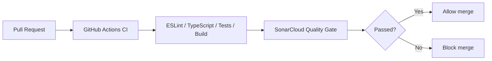

# Flavoriy

Flavoriy is a cloud-native DevOps platform built around TikTo, a Next.js and TypeScript task planning application. It covers continuous integration, container delivery, AWS infrastructure provisioning, and GitOps-based Kubernetes deployment.

The repositories are separated by responsibility: application source code, cloud infrastructure, Kubernetes deployment manifests, and platform-level documentation.

## Overview

The platform combines GitHub Actions, Terraform, AWS, Docker, k3s, Argo CD, Kustomize, GHCR, Trivy, SonarCloud, AWS Secrets Manager, and External Secrets Operator into one end-to-end delivery workflow.

## CI/CD Architecture

### Pull Request Validation

### Deployment Through GitOps

```mermaid
flowchart LR
    Merge[Merge to dev / main] --> CD[GitHub Actions CD]
    CD --> Secrets[AWS OIDC + Secrets Manager]
    Secrets --> Build[Docker build]
    Build --> Scan[Trivy HIGH / CRITICAL scan]
    Scan --> GHCR[Push image to GHCR]
    GHCR --> Tag[dev-42 / prod-43]
    Tag --> Patch[Patch Kustomize image]
    Patch --> GitOps[gitops-manifest]
    GitOps --> Argo[Argo CD sync]
    Argo --> K3s[k3s rollout]
    K3s --> Verify[Verify health and image]
```

| Stage | Responsibility |
|---|---|
| Pull request validation | Runs ESLint, TypeScript validation, unit tests, build checks, coverage reporting, and SonarCloud quality gates before merge |
| Image delivery | Builds the Docker image, scans HIGH/CRITICAL vulnerabilities with Trivy, and publishes an environment-scoped tag to GHCR |
| GitOps release | Updates the matching Kustomize image patch in `gitops-manifest` instead of mutating the cluster directly |
| Runtime verification | Argo CD syncs the GitOps state into k3s and verifies the deployed workload health and image tag |
| Secret loading | GitHub Actions reads CI/CD values from AWS Secrets Manager; runtime Kubernetes secrets are synchronized through External Secrets Operator |

## Repository Map

| Repository | Purpose | Main technologies |
|---|---|---|
| `TikTo` | Application source code, reusable CI/CD workflows, Docker image delivery, Trivy scanning, GHCR publishing, GitOps updates, and Argo CD verification. | Next.js, TypeScript, React, Supabase, Prisma, GitHub Actions, Docker, Trivy, SonarCloud |
| `IaC` | AWS infrastructure provisioning for development and production-like k3s environments. | Terraform, AWS VPC, EC2, EIP, Security Groups, S3 backend, DynamoDB locking, Checkov |
| `gitops-manifest` | Kubernetes desired state for the application. | Kubernetes, Kustomize, Argo CD, External Secrets Operator, PodDisruptionBudget |
| `.github` | Organization profile and platform-level documentation. | GitHub profile README, architecture documentation |

## Key Capabilities

- Cloud-native delivery platform for a Next.js and TypeScript application, covering CI, container delivery, AWS infrastructure provisioning, and Kubernetes deployment.
- Reusable GitHub Actions workflows for ESLint analysis, TypeScript validation, unit testing, coverage reporting, application builds, and SonarCloud quality-gate checks.
- Automated Docker image delivery with environment-scoped version tags, Trivy HIGH/CRITICAL vulnerability scanning, and GHCR publishing.
- Terraform modules for AWS networking and compute resources, including VPC, subnets, route tables, security groups, Elastic IPs, and EC2 instances.
- Development and production-like k3s environments, including a three-server production-like topology across three Availability Zones.
- GitOps-based Kubernetes deployment with Argo CD and Kustomize overlays, with runtime secrets synchronized from AWS Secrets Manager through External Secrets Operator.
- Terraform remote state with Amazon S3 and DynamoDB locking, Checkov scanning, manual apply/destroy workflows, and EC2 start/stop automation for cost control.

## Delivery Workflow

1. A pull request runs the CI pipeline: linting, type checking, tests, build validation, and SonarCloud analysis.
2. Merging to `dev` runs the CD pipeline and deploys to the development environment.
3. Merging to `main` runs the CD pipeline through the protected production environment.
4. The CD workflow assumes AWS credentials through OIDC, loads runtime values from AWS Secrets Manager, builds and scans the Docker image, and pushes it to GHCR.
5. The workflow updates the matching Kustomize image patch in `gitops-manifest`.
6. Argo CD syncs the cluster from Git and verifies the deployed image.

## Environment Design

| Environment | Infrastructure | Deployment model | Purpose |
|---|---|---|---|
| Development | One k3s node on EC2 | One application replica, dev Kustomize overlay | Fast integration validation |
| Production-like | Three k3s server nodes across three AZs | Three replicas, topology spread, PDB, prod Kustomize overlay | Demonstrates multi-node Kubernetes and GitOps operations |

The production-like environment is intentionally compact and cost-aware while still covering important operational concerns: multi-node k3s, GitOps reconciliation, runtime secrets, workload spreading, and rollback through Git.

## Security and Operations

- GitHub Actions OIDC for short-lived AWS access in application delivery workflows.
- AWS Secrets Manager for shared CI/CD values and runtime environment secrets.
- External Secrets Operator to sync AWS secrets into Kubernetes.
- Trivy image scanning before publishing application images.
- SonarCloud quality gate in CI.
- Checkov scanning for Terraform changes.
- Remote Terraform state in S3 with DynamoDB locking.

## Technology Stack

| Area | Tools |
|---|---|
| Application | Next.js, React, TypeScript, Tailwind CSS, Supabase, Prisma, Zod |
| CI/CD | GitHub Actions, reusable workflows, composite actions |
| Container | Docker, GHCR, Trivy |
| Infrastructure | Terraform, AWS VPC, EC2, EIP, S3, DynamoDB |
| Kubernetes | k3s, Kustomize, Argo CD |
| Secrets | AWS Secrets Manager, External Secrets Operator |
| Quality and security | SonarCloud, ESLint, Vitest, Checkov |
