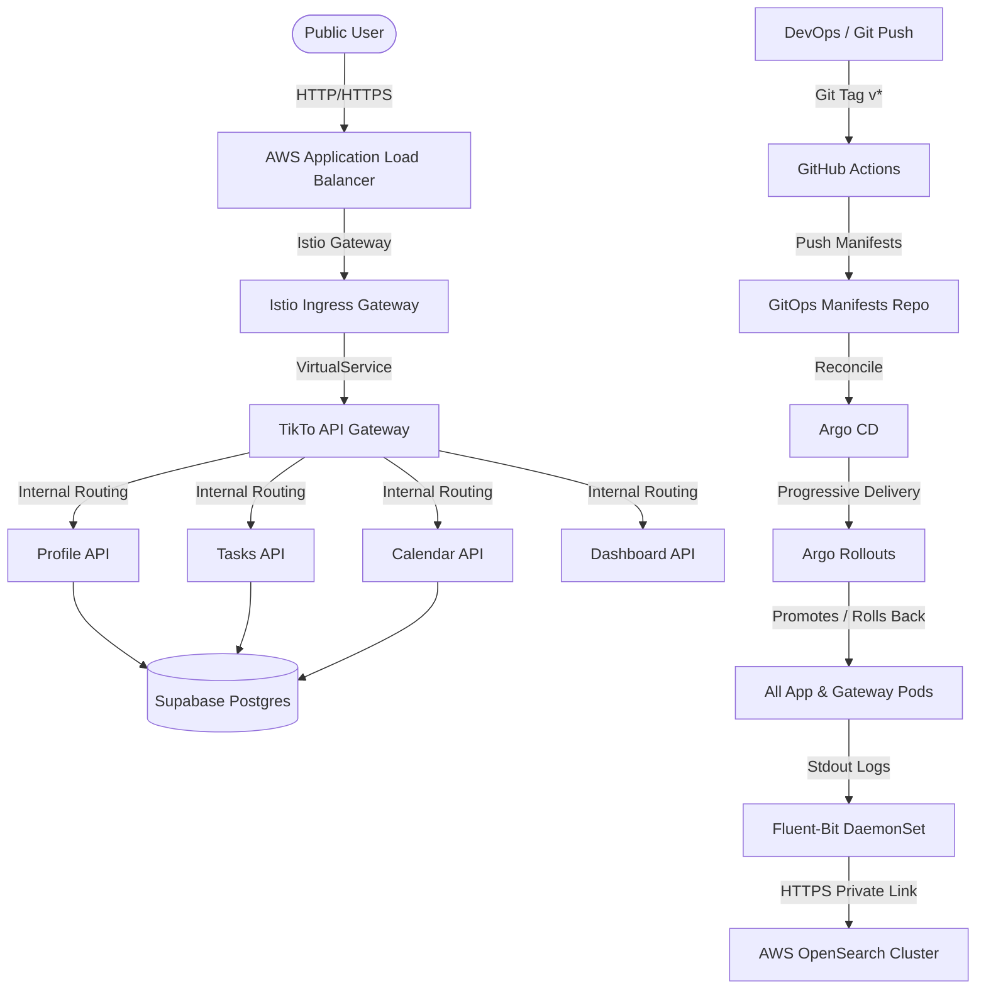
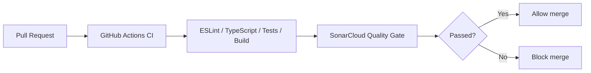

# 🌟 Flavoriy: Cloud-Native DevOps & Canary Rollout Platform

Welcome to **Flavoriy**, a production-grade, end-to-end DevOps demonstration platform. Flavoriy showcases a modern, automated CI/CD pipeline, Infrastructure as Code (IaC), GitOps, and Progressive Canary Deployments. 

At the core of the platform is **TikTo**, a task and calendar planning application structured as a microservices monorepo.

## 🎬 Demo Video

Watch the Flavoriy platform in action via the demo video file in this repository:

- Demo video:
[![Link Video Demo]](https://drive.google.com/file/d/1kddM6QnQ3sY4wKi87aM86xotZ-vXINXj/view?usp=sharing)

---

## 🗺️ System Architecture

The following diagram illustrates the network flow, ingress routing via Istio, and telemetry/logging path using Fluent-Bit and AWS OpenSearch:

---

## 📂 Repository Structure

The Flavoriy project is organized into three major sub-repositories/directories, separating application logic, cloud infrastructure, and deployment manifests:

| Folder / Repo | Purpose | Core Technologies |
| :--- | :--- | :--- |
| [**`TikTo`**](../TikTo) | Application monorepo containing the web frontend, API gateway, and individual backend microservices. | Next.js, Node.js, Prisma, Supabase, Docker, GitHub Actions |
| [**`IaC`**](../IaC) | Infrastructure as Code configuration to provision the AWS cloud resources, EKS cluster, private OpenSearch, and networking. | Terraform, AWS (VPC, EKS, OpenSearch, Secrets Manager), Tailscale VPN |
| [**`gitops-manifest`**](../gitops-manifest) | Continuous Delivery repository containing Kustomize templates, Argo CD application specs, and Argo Rollouts progressive canary workflows. | Kustomize, Argo CD, Argo Rollouts, External Secrets Operator, Istio |

---

## 🔄 CI/CD & Delivery Flow

### Pull Request Validation

### Progressive Canary Delivery

```mermaid
flowchart LR
    Merge[Merge / Tag v*] --> CD[GitHub Actions CD]
    CD --> Secrets[AWS OIDC + Secrets Manager]
    Secrets --> Build[Docker Build & Trivy Scan]
    Build --> GHCR[Push to GHCR]
    GHCR --> Patch[Patch Kustomize Image]
    Patch --> GitOps[gitops-manifest Commit]
    GitOps --> Argo[Argo CD Sync]
    Argo --> Rollout[Argo Rollout Canary]
    Rollout --> Test[Smoke Test & OpenSearch Check]
    Test --> Promote[100% Stable Promotion]
```

---

## 🚀 Key Features

* **Microservice Monorepo (`TikTo`)**: Next.js App Router acting as the user interface and Backend-for-Frontend (BFF), backed by an Express-based API Gateway, and 5 microservices communicating via internal cluster DNS.
* **Infrastructure as Code (`IaC`)**: Automated provisioning of VPC, EKS cluster (with Spot instance node groups), AWS OpenSearch, and AWS Secrets Manager via modular Terraform.
* **Progressive Canary Delivery**: Argo Rollouts uses Istio to shift traffic incrementally. Integrated with automated Kubernetes smoke-test jobs (200 requests) and real-time OpenSearch log queries to verify deployment safety before promotion.
* **Secret Management**: External Secrets Operator synchronizes credentials directly from AWS Secrets Manager into Kubernetes Secrets, keeping secret values completely out of git.

---

## 🛠️ Technology Stack

| Area | Tools & Technologies |
| :--- | :--- |
| **Application** | Next.js, React, TypeScript, Tailwind CSS, Supabase, Prisma, Zod |
| **CI/CD** | GitHub Actions, reusable workflows, composite actions, OIDC authentication |
| **Container & Security** | Docker, GHCR, Trivy Vulnerability Scanning |
| **Infrastructure** | Terraform, AWS VPC, EKS, EC2, EIP, S3, DynamoDB |
| **Kubernetes / GitOps** | Argo CD, Argo Rollouts, Kustomize, Istio Service Mesh |
| **Secrets** | AWS Secrets Manager, External Secrets Operator |
| **Quality & Logging** | SonarCloud, ESLint, Vitest, Checkov, Fluent-Bit, AWS OpenSearch |
